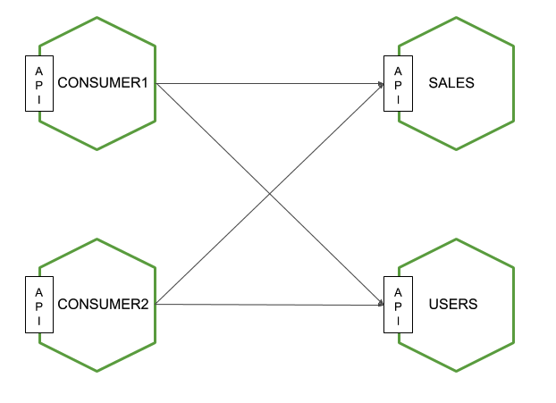

# Contract Testing Example

This project shows how to use [Pact](http://docs.pact.io).

In this example, we have four services: two services that provides an enpoint to the other two services.



Requierements:

* Java 1.8
* Docker
* Docker Compose

To run the example, there are three steps:

Run a Pact Broker server:

1. Execute:
```
docker-compose -f pact-broker/docker-compose.yml up -d
```
2. Set the following environment variables:
```
export PACT_BROKER_HOST=<<docker host ip>>
export PACT_BROKER_PORT=8383
export PACT_BROKER=http://${PACT_BROKER_HOST}:${PACT_BROKER_PORT}
```

Generate the pacts from both consumers:

1. Generate pacts from consumer1:
```
cd consumer1
./build.sh
./publish-contracts.sh
cd ..
```
2. Generate pact from consumer2:
```
cd consumer2
./build.sh
./publish-contracts.sh
cd ..
```
Now, you can browse Pact Broker to find all pacts. Open in a browser the URL shows in the variable PACT\_BROKER.

Verify the pacts on each service provider:

1. Verify the pacts on Users service:
```
cd users
./build.sh
./verify-contracts.sh
cd ..
```
2. Verify the pacts on Sales service:
```
cd sales
./build.sh
./verify-contracts.sh
cd ..
```
